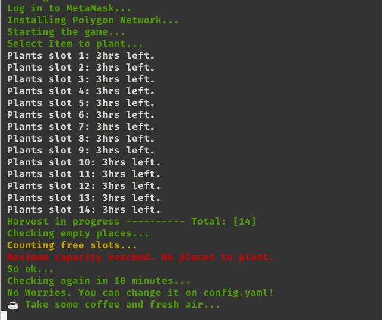

# Sunflower-farmers-auto-bot
Sunflower Farmers NFT Game automated bot.IT IS NOT a cheat or hack bot.
Totally open source, you can check all code.

# Functions enabled:
 - auto login
 - auto polygon setup
 - plant
 - monitor
 - harvest
 - save

### Please, consider donate some if I help you in any way
My wallet address:

**0x82249B72Fb97eB5A54CF769f91f049ecaF31F7bd**




# Instalation:

You'll need to install python if you're using windows.
https://www.python.org/downloads/

After that install requirements.
```
pip install requirements.txt
```


# Settings:

### For single account open the config.yaml file and edit this lines.

Note: Please take care with your secret phrase.
```
private:
  secret_phrase: your secret phrase here
  passwd: your_password
```

Linux users can use env vars. Just enable this variable:

```
set_linux_env: true
```
After that set the variable names in your system:

```
SUNFLOWER (secret Phrase)
PASSWD (password)
```

### For multi account open the config.yaml file and edit this lines.
**Note: On multi acc, the browser will always be closed to avoid many system memory usage.** 

Uncomment these lines and set *use_multi_acc* to 'true'
```
use_multi_acc: true
multi_acc_list:
  - [phrase1, passwd1]
  - [phrase2, passwd2]  
  - [phrase3, passwd3]
```

**Changing vegetables:**

Got to config.yaml file and set desired plant:

Example:
```
selected_plant: sunflower
```
Choices are:

```
sunflower
potato
pumpkin
beetroot
caluflower
parsnip
```

# Usage:

On cmd (windows) or console(unix systems) start the bot with command:

```
python main.py
```

Enjoy it guys.

# Please Help
I've not tested on windows. If you want to help, please test by yourself, and tell us about.
PR are welcome
